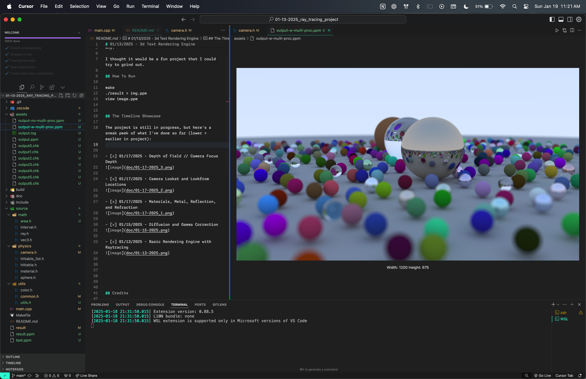
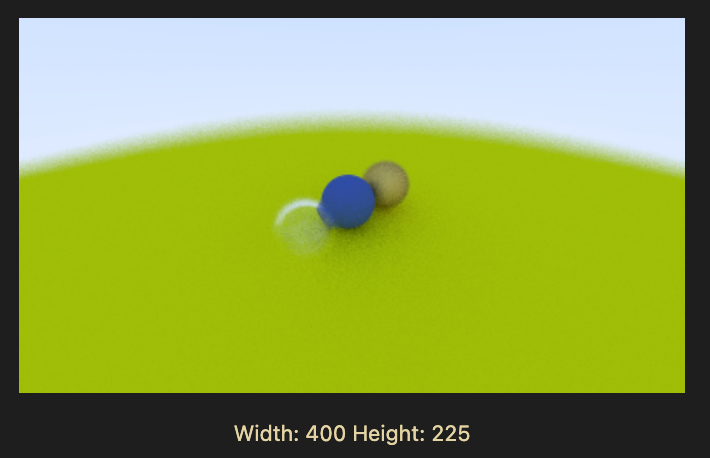
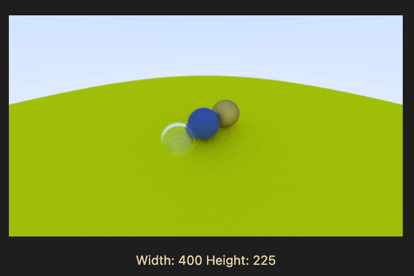
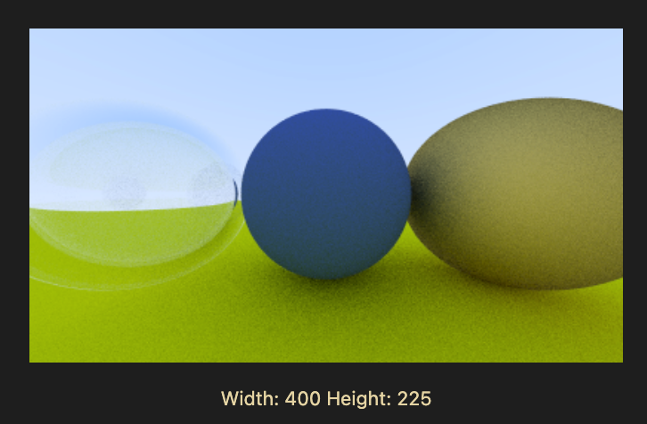
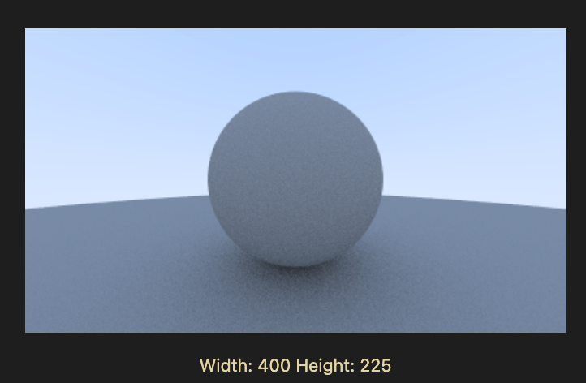
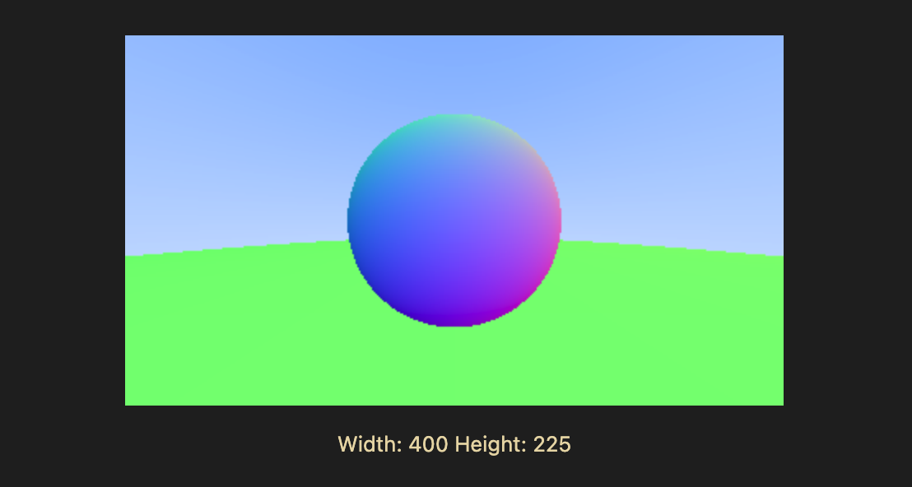

# 01/13/2025 - 3d Text Rendering Engine

Essentially, this is a ray-tracer I've built in C++.

Why?

I thought it would be a fun project that I could try to grind out.

## How To Run

make
./result > img.ppm
view image.ppm

## The Timeline Showcase

The project is still in progress, but here's a sneak peek of what I've done so far (lower = earlier in project):

- [x] 01/19/2025 - Multi-Core Rendering (for Mac M2)

I managed to drastically reduce rendering times by using multi-core processing. Mac had a pretty nice and simple implementation of the Multi-Core Processing system -- but I just used the standard `fork()` system call to create child processes, and went off from there.

The end result?

I'd guess probably a 7x reduction in computation time. It's probably not the greatest impleentation, but I felt like GOD when I managed to figure it out.

- [x] 01/17/2025 - Depth of Field // Camera Focus Depth

- [x] 01/17/2025 - Camera Lookat and Lookfrom Locations

- [x] 01/17/2025 - Materials, Metal, Reflection, and Refraction

- [x] 01/15/2025 - Diffusion and Gamma Correction

- [x] 01/13/2025 - Basic Rendering Engine with Raytracing

## Credits

[_Ray Tracing in One Weekend_](https://raytracing.github.io/books/RayTracingInOneWeekend.html)
